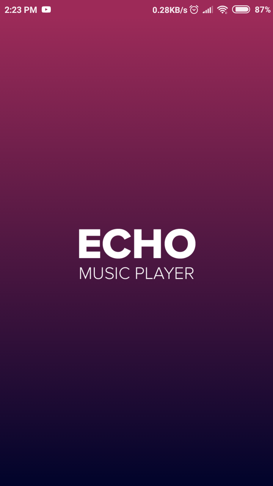
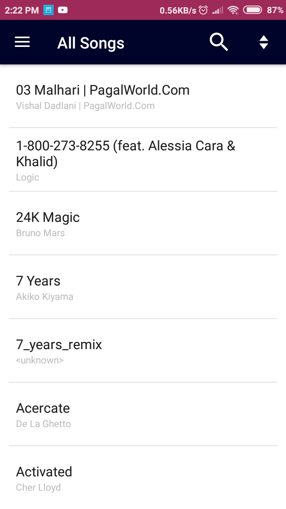
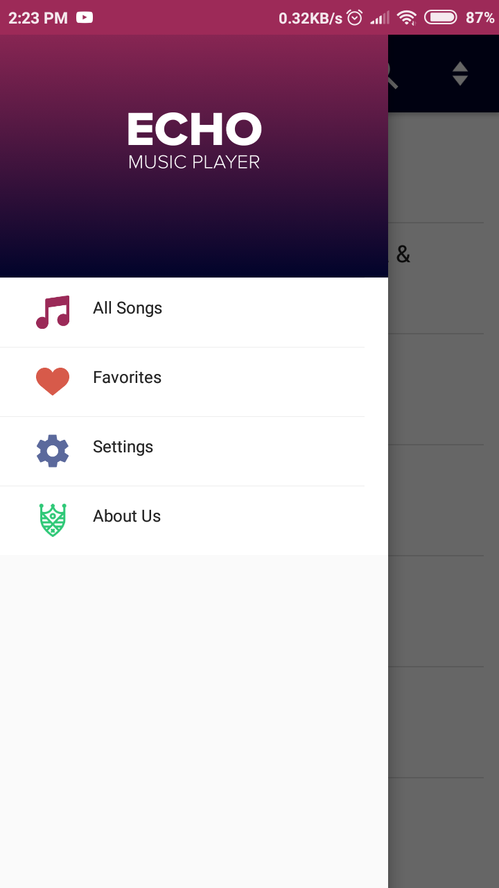
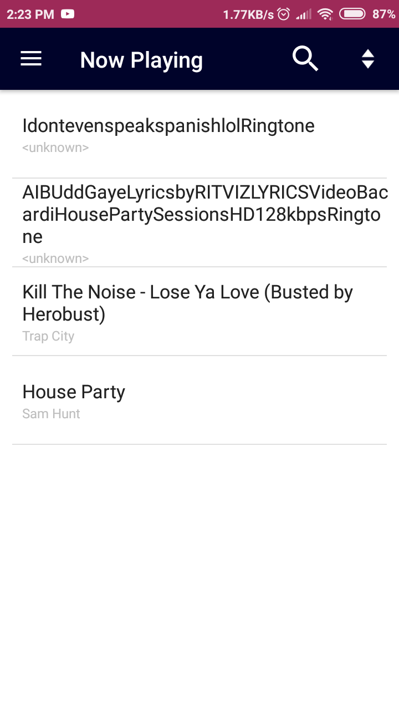
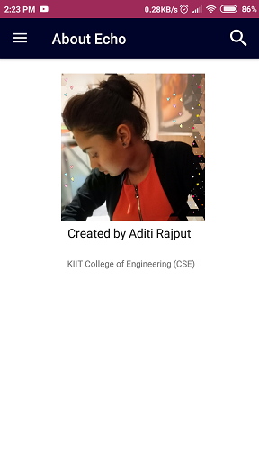

# Echo-MusicPlayer
This is a music player developed for android 4.0 and above 

Echo is created using Andriod Studiod and tested on Andriod 7.1 
#Splash Screen

It is coded in Kotlin and Xml For UI 

It has many features like
#Now playing

#Navigaion drawer

#Add song to favourite

#Shake to cange song is experimental may not work on all devices

#About us

#It also comes with a visualizer (cleveroad )

<a href="https://github.com/Cleveroad/WaveInApp"> Github Link </a>

Echo is created during the summer training program of Internshala.com

