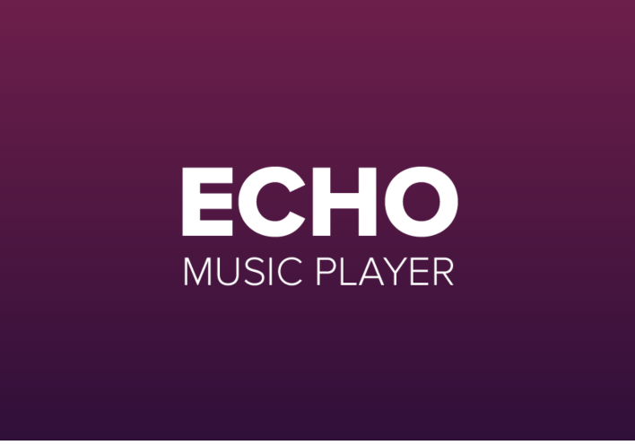
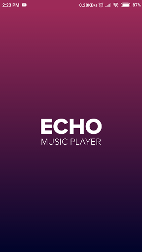
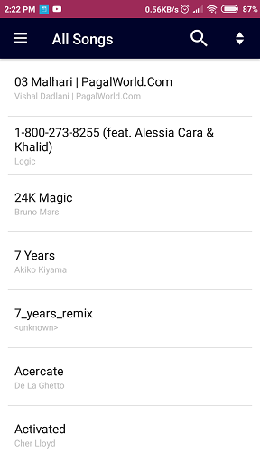
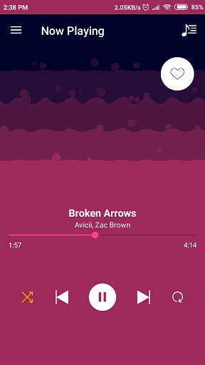
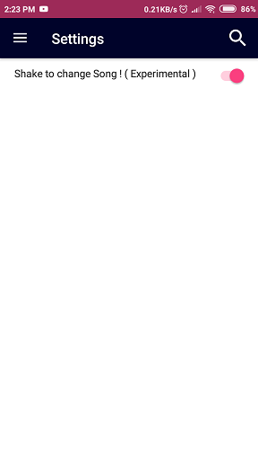
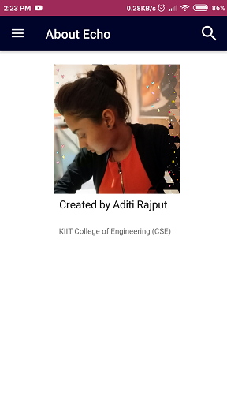
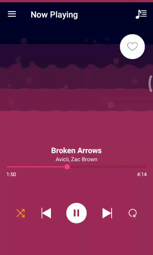

# Echo-MusicPlayer
This is a music player developed for android 4.0 and above 

Echo is created using Andriod Studiod and tested on Andriod 7.1 
# Splash Screen  

It is coded in Kotlin and Xml For UI 

It has many features like
# Now playing  

# Navigaion drawer  

# Add song to favourite  

# Shake to cange song is experimental may not work on all devices  

# About us  

# It also comes with a visualizer (cleveroad )  

<a href="https://github.com/Cleveroad/WaveInApp"> Github Link </a>  
  

Echo is created during the summer training program of Internshala.com

